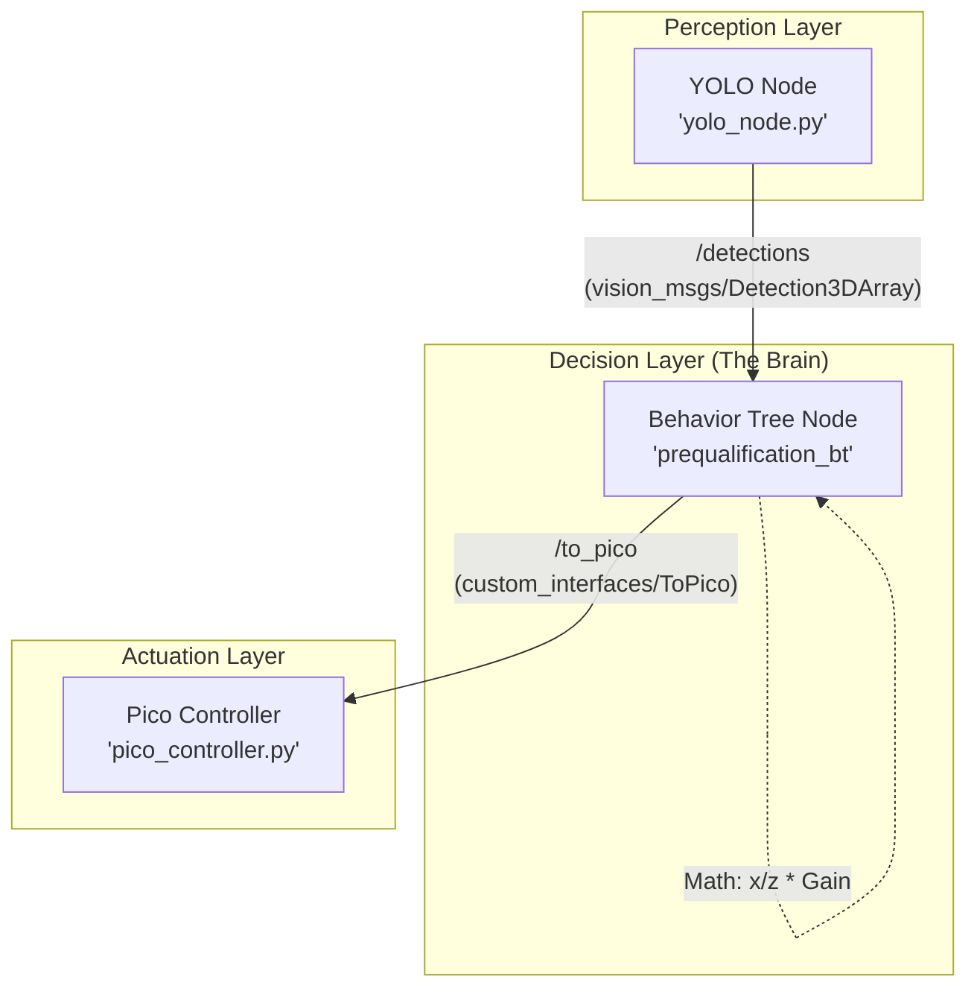

# Robosub Behavior Tree & Control System Guide

This document explains the architecture and logic of the Prequalification Mission.

## 1. System Architecture Overview

### Visual ROS 2 Graph


### ROS 2 Components Explained
- **Perception Node (`yolo_node.py`)**: 
    - **Role**: The "Eyes."
    - **Publisher**: Sends 3D coordinates (x, y, z) to the **`/detections`** topic.
- **Behavior Tree Node (`prequalification_bt`)**: 
    - **Role**: The "Brain."
    - **Subscriber**: Listens to **`/detections`** to see where the objects are.
    - **Publisher**: Calculates steering and sends commands to the **`/to_pico`** topic.
- **Pico Controller Node (`pico_controller.py`)**: 
    - **Role**: The "Muscles."
    - **Subscriber**: Listens to **`/to_pico`** and converts the `delta_yaw` and `delta_d` values into physical thruster power.

---

## 2. Visual Alignment: The Math
When the Behavior Tree runs the `AlignWithObject` node, it performs the following loop:

1.  **Extract Data**: Get $x$ (horizontal offset) and $z$ (distance) from the `/detections` subscriber.
2.  **Normalize**: Calculate $e_{norm} = \frac{x}{z}$. This converts distance into an angular error.
3.  **Control**: Command a turn using $\text{delta\_yaw} = -1.5 \times e_{norm}$.
4.  **Publish**: Send this value to the Pico Controller via the `/to_pico` topic.
---

## 3. Mission Structure (Behavior Tree)
The mission follows this hierarchical structure. In Groot2, **Sequence** nodes are ➔ and **Fallback** nodes are ?.

```mermaid
graph TD
    Root[Sequence: Prequalification Task] --> Check[Retry Until Successful]
    Check --> AllSystems[Condition: AllSystemsOK]
    
    Root --> Dive[Action: DiveToDepth: 1.5m]
    
    %% Gate Phase
    Root --> GatePhase[Fallback: Find Gate]
    GatePhase --> GateSeen[Condition: IsObjectSeen GATE]
    GatePhase --> GateSearch[Action: Do360Turn GATE]
    
    Root --> GateAlign[Action: AlignWithObject GATE]
    Root --> GatePass[Action: DriveThruGate {T1}]
    
    %% Pole Phase
    Root --> Pause1[Action: StayStill 3s]
    Root --> PolePhase[Fallback: Find Pole]
    PolePhase --> PoleSeen[Condition: IsObjectSeen POLE]
    PolePhase --> PoleSearch[Action: Do360Turn POLE]
    
    Root --> PoleAlign[Action: AlignWithObject POLE]
    Root --> PoleApproach[Action: ApproachObject 2.0m]
    Root --> PoleOrbit[Action: NavigateAround 8-Step Orbit]
    
    %% Return Phase
    Root --> Pause2[Action: StayStill 3s]
    Root --> BlindReturn[Action: NavigateTo {T1} Reversed]
    
    Root --> ReturnGatePhase[Fallback: Find Gate for Return]
    ReturnGatePhase --> RGateSeen[Condition: IsObjectSeen GATE]
    ReturnGatePhase --> RGateSearch[Action: Do360Turn GATE]
    
    Root --> RGateAlign[Action: AlignWithObject GATE]
    Root --> RGatePass[Action: DriveThruGate 4.0m]
    Root --> FinalStop[Action: StayStill 3s]
```

---

## 4. The Behavior Tree (Logic Layer)
The mission is defined in `src/prequalification_bt/config/prequalification.xml`.

### Key Control Nodes:
- **`Sequence` (➔)**: Runs children one-by-one. If one fails, the mission stops.
- **`Fallback` (?)**: The "Try/Except" of logic. It tries the first child; if that fails, it runs the second (e.g., "If I don't see the gate, start spinning to find it").
- **`Blackboard`**: Shared memory. 
    - `{T1}`: Gate entry position (used for the return trip).

---

## 5. C++ Node Implementations (Action Layer)
Located in `src/prequalification_bt/bt_nodes.cpp`.

### `AlignWithObject` (Visual Centering)
- **Input**: `object` (GATE or POLE).
- **Logic**: Calculates the horizontal error (`norm_x`) from the camera center.
- **Command**: Sends a `delta_yaw` to the robot to rotate until the object is centered.

### `DriveThruGate` (Stabilized Pass)
- **Phase 1: ALIGN**: Uses visual centering.
- **Phase 2: DRIVE**: Timed surge with heading lock.
- **The Stabilization Timer**: Before starting Phase 2, the robot must be centered ($e_{norm} < 0.04$) for **1.0 continuous second**. During this second, the robot commands `0,0,0` (stop) to damp its momentum and ensure a perfect "aim" before the blind drive.

#### **Stabilization State Machine**
```mermaid
state_machine
    [*] --> Searching : Gate not seen
    Searching --> Centering : Gate seen
    Centering --> Searching : Gate lost
    
    Centering --> HoldingBreath : Error < 0.04
    HoldingBreath --> Centering : Error > 0.04 (Wobble)
    HoldingBreath --> HoldingBreath : Timer < 1.0s (Command Stop)
    
    HoldingBreath --> Driving : Timer >= 1.0s (Lock Heading)
    Driving --> [*] : Drive Time Expired
```

### `NavigateAround` (Sway-less Orbit)
- **Goal**: Perform an 8-step tangential orbit around the pole.
- **Phase 1: Align**: Face the pole directly.
- **Phase 2: Turn**: Turn ~90° to be tangent to the circle.
- **Phase 3: Surge**: Drive forward for 3 seconds.
- **Radial Correction**: Dynamically adjusts the turn angle if the robot is closer or further than the 2.0m target.

### `NavigateTo` (Blind Return)
- **Logic**: Uses the saved `{T1}` pose.
- **Reversed Heading**: Adds 180° to the entry heading to point back towards the start.
- **Timed Surge**: Drives for 10 seconds to close the gap before switching back to visual detection.

---

## 6. Communication (The `ToPico` Message)
The BT sends a `custom_interfaces/msg/ToPico` message to the thruster controller:
- `delta_yaw`: How much to turn (-1.0 to 1.0).
- `delta_d`: Forward/Backward power (Surge).
- `target_depth`: Maintained by the Pico's internal PID.
- `stop_bit`: If `1`, all motors stop immediately.

---

## 7. How to Launch Groot2
To open the visualization tool with the correct model loaded, use this command:

```bash
/home/farha/Downloads/Groot2-v1.9.0-x86_64.AppImage --file /home/farha/robosub/src/prequalification_bt/config/prequalification.xml
```

*Note: Use the `prequalification.xml` file because it contains both the tree and the node definitions (palette) in one file.*
alette) in one file.*
